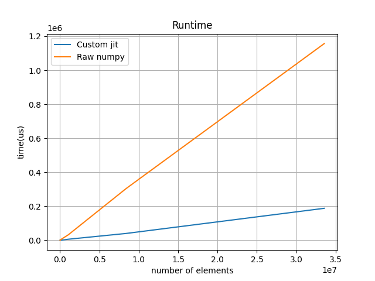
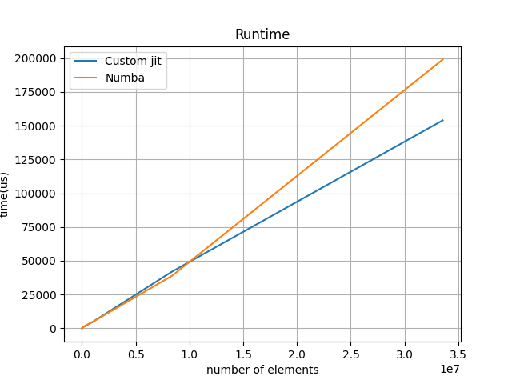
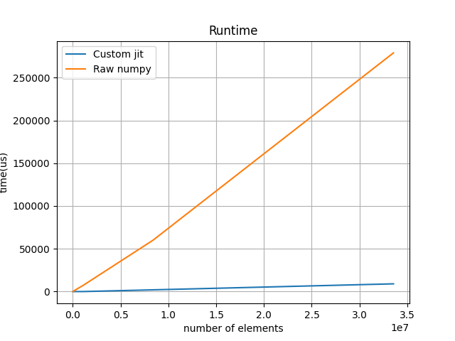
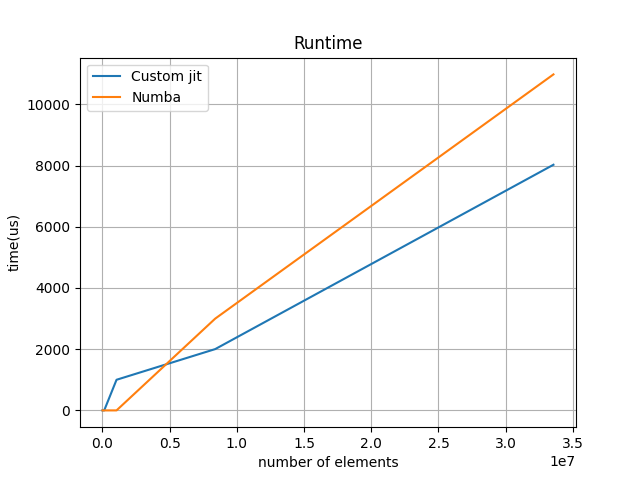

## you have to copy the .pyd to the tests.py folder for it to work
## also needs python,numpy,numba,pyplot etc etc and pybind11
## some tests to compare vs numba and referece 
- element wise fusion VS numpy raw 

- element wise fusion VS numba jit

- map reduce VS numpy raw

- map reduce VS numba jit
